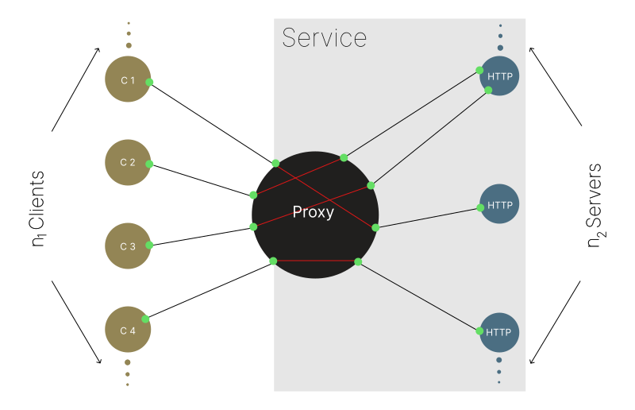

# Adam Patterson

**Full Stack Software & Data Engineer**

## Navigation

- [About me](#about-me)
- [Public projects on GitHub](#public-projects-on-github)
- [Research Collaborations & Publications](#research-collaborations--publications)
- [Contact](#contact)
- [Links](#links)

## About me

I have more than 10 years of experience working in full-stack software and data engineering roles. I hold a [Master's degree](https://www.si.umich.edu/programs/master-applied-data-science) in Applied Data Science from the [University of Michigan](https://umich.edu).

My software engineering background spans diverse domains including education, the health sciences, mechanical systems, telephony, and agentic AI.

My GitHub repositories are pushed to the [FAR Analytics & Research](https://github.com/faranalytics) GitHub organization. Examples of my work can also be found in the repositories of the [Educational Technology Collective](https://github.com/educational-technology-collective).

Please see my [resume](./Adam_Patterson_Resume.pdf) and [LinkedIn](https://www.linkedin.com/in/adamjpatterson/) profile for more information on my professional background.

## Public projects on GitHub

### [Dialog](https://github.com/faranalytics/dialog) <sup><sup>`</TypeScript>` `</Node.js>`</sup></sup>

Dialog is a modular VoIP-Agent STT, TTS, and LLM orchestration layer that uses conversational AI for handling voice calls. Dialog provides example implementations for each of the artifacts that comprise a VoIP-Agent application. You can use an implementation as-is, subclass it, or implement one of the provided interfaces.

### [Socketnaut](https://github.com/faranalytics/socketnaut) <sup><sup>`</TypeScript>` `</Node.js>`</sup></sup>



Socketnaut makes scaling native Node.js servers easy. A Socketnaut Service consists of a TCP proxy and a pool of HTTP servers. Socketnaut will uniformly distribute incoming TCP sockets across the pool of allocated servers. This strategy allows for both distribution and parallel processing of incoming requests. Socketnaut consumes native Node.js servers (e.g., http.Server, https.Server, net.Server, tls.Server); hence, if you know the Node API, you already know how to build applications on Socketnaut.

Socketnaut can be combined with performant Node.js web application frameworks (e.g., Fastify, Koa, Express) in order to easily scale the main module of the web application.

A single Socketnaut instance can handle thousands of concurrent connections when running on capable hardware. When under load, Socketnaut will spawn HTTP servers in order to meet demand and release resources as demand declines; hence, Socketnaut mitigates its memory footprint by effectively managing its thread pool.

### [Auto](https://github.com/faranalytics/auto)<sup><sup>`</Python>`</sup></sup>

Auto is an educational/demonstrational autonomous context window management implementation. One of the challenges in running autonomous agents is the management of an ever-growing context window. This proof-of-concept implementation gives the agent the capability to manage its context window autonomously.

### [Pydot Flow](https://github.com/faranalytics/pydot-flow)<sup><sup>`</Python>`</sup></sup>

A flowing application programming interface for creating Graphviz visualizations using Pydot. Pydot flow makes it a little easier to assemble simple flowing graphs using Pydot.

### [Network⬄Services](https://github.com/faranalytics/network-services)<sup><sup>`</TypeScript>` `</Node.js>`</sup></sup>

Network⬄Services provides a simple and intuitive toolkit that makes scaling your app and connecting it to the network easy. You can use it to transform an arbitrary application into a network-connected scalable Service Application. You can connect to your Service App, from the same process or another process, and call methods on it using a type-safe Service API.

### [Streams Logger](https://github.com/faranalytics/streams-logger)<sup><sup>`</TypeScript>` `</Node.js>`</sup></sup>

Streams is an intuitive and performant type-safe logger built on native Node.js streams. You can use the built-in logging components (e.g., the Logger, Formatter, Filter, ConsoleHandler, RotatingFileHandler, and SocketHandler) for common logging tasks or implement your own logging Node to handle a wide range of logging scenarios. Streams offers a graph-like API pattern for building sophisticated logging pipelines.

### [Memoiz](https://github.com/faranalytics/memoiz)<sup><sup>`</Python>`</sup></sup>

Memoiz provides a function decorator that can be used in order to augment functions or methods with memoization capabilities. It makes reasonable assumptions about how and if to cache the return value of a function or method based on the arguments passed to it. The decorator can be used on both free and bound functions.

### [JupyterLab Telemetry](https://github.com/educational-technology-collective/etc_jupyterlab_telemetry_library)<sup><sup>`</Python>` `</JavaScript>`</sup></sup>

A JupyterLab extension for capturing JupyterLab events - deployed to the Coursera learning environment.

### [Port Agent](https://github.com/faranalytics/port_agent)<sup><sup>`</TypeScript>` `</Node.js>`</sup></sup>

Port Agent provides a simple and intuitive interface that makes inter-thread function calls easy. Port Agent will marshal the return value or Error from the other thread back to the caller. The other thread may be the main thread or a worker thread.

### [Scalability](https://github.com/faranalytics/scalability)<sup><sup>`</TypeScript>` `</Node.js>`</sup></sup>

Scalability is a type-safe service scaling facility built on Network⬄Services. It provides a simple and intuitive API for scaling Node.js modules using Worker threads. You can create a Service App in your scaled module and call its methods from the main thread using a Service API. Scalability allows you to easily transform your single threaded application into a type-safe multithreaded one.

### [JS HTML Renderer](https://github.com/faranalytics/js-html-renderer)<sup><sup>`</TypeScript>` `</Node.js>`</sup></sup>

A JS DSL for rendering HTML on the client or the server. The JS HTML Renderer provides a concise and intuitive syntax for writing HTML using JavaScript.

### [The Data Science Project](https://github.com/faranalytics/data_science_project)<sup><sup>`</Python>`</sup></sup>

The IMRaD-like Python project templates for data science projects.

In the data science domain projects are sometimes shared as an informal assemblage of scripts. This repository proposes two IMRaD-like layouts that can be used for organizing a data science project. The "Informal IMRaD-like Layout" is a Python project organized into materials, methods, and results directories. The "Formal IMRaD-like Flat Layout" is a conventional installable Python flat-layout project that can be built and distributed as a package and published to PyPI.

### [Neural-pleX](https://github.com/faranalytics/neuralplex/)<sup><sup>`</Python>`</sup></sup>

Neural-pleX is an educational/experimental object oriented neural network implementation. The Neural-pleX API consists of Network, Layer, and Neuron constructors. The networks can be easily visualized using a visualization library.

## Research Collaborations & Publications

### [Impact of the Adverse Social Exposome on Survival in Individuals With Amyotrophic Lateral Sclerosis](https://doi.org/10.1212/wnl.0000000000213362)

- _Neurology_
- 2025-02-25 | Journal article
- DOI: [10.1212/wnl.0000000000213362](https://doi.org/10.1212/wnl.0000000000213362)

### [The determinants of complication trajectories in American Indians with type 2 diabetes](https://doi.org/10.1172/jci.insight.146849)

- _JCI Insight_
- 2021-05-24 | Journal article
- DOI: [10.1172/jci.insight.146849](https://doi.org/10.1172/jci.insight.146849)

### [Untargeted metabolomics yields insight into ALS disease mechanisms](https://doi.org/10.1136/jnnp-2020-323611)

- _Journal of Neurology, Neurosurgery & Psychiatry_
- 2020-12 | Journal article
- DOI: [10.1136/jnnp-2020-323611](https://doi.org/10.1136/jnnp-2020-323611)

### [High plasma concentrations of organic pollutants negatively impact survival in amyotrophic lateral sclerosis](https://doi.org/10.1136/jnnp-2018-319785)

- _Journal of Neurology, Neurosurgery & Psychiatry_
- 2019-08 | Journal article
- DOI: [10.1136/jnnp-2018-319785](https://doi.org/10.1136/jnnp-2018-319785)

## Contact

- **tel:** [(734) 418-0705](tel:734.418.0705)
- **mailto:** [adam@farar.net](mailto:adam@farar.net)

## Links

- [GitHub](https://github.com/adamjpatterson)
- [LinkedIn](https://www.linkedin.com/in/adamjpatterson/)
- [ORCID](https://orcid.org/0000-0003-3893-8670)

## Colophon

```
git symbolic-ref HEAD refs/heads/_ && rm .git/index && git add . && git commit -m "$(date)" && git branch -D main && git
branch -M _ main && git reflog expire --expire=now --all && git gc --prune=all --aggressive && git push --force --set-upstream origin main
```
