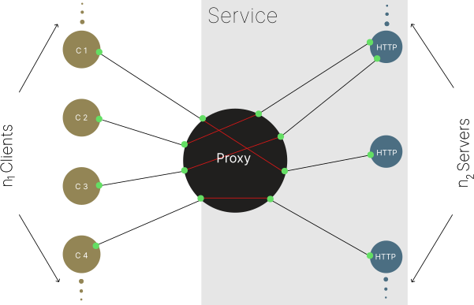
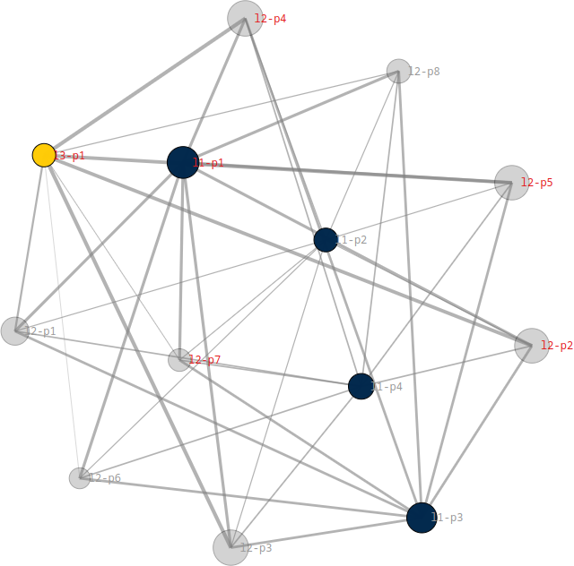

# Introduction

I am a data architect and full stack engineer with an interest in machine learning. My formal education includes a [Master's degree](https://www.si.umich.edu/programs/master-applied-data-science) in applied data science.  

My personal GitHub repositories are pushed to the [FAR Analytics & Research](https://github.com/faranalytics) GitHub organization. Examples of my work can also be found in the repositories of the [Educational Technology Collective](https://github.com/educational-technology-collective).

My University of Michigan enterprise GitHub account is located [here](https://github.com/adpatter).

## A selection of public projects that I am working on:
* [*Network⬄Services*](https://github.com/faranalytics/network-services) A type safe asynchronous RPC Service facility for connecting your apps to the network and scaling them using Worker threads.
* [Socketnaut](https://github.com/faranalytics/socketnaut) Scalable multithreaded Node.js servers made easy.
* [Port Agent](https://github.com/faranalytics/port_agent) A RPC-like facility for making inter-thread function calls.
* [Python memoiz](https://github.com/faranalytics/python_memoiz) A thread-safe memoization decorator for Python.
* [JS HTML Renderer](https://github.com/faranalytics/js-html-renderer) A JS DSL for rendering HTML on the client or the server.
* [JupyterLab Telemetry](https://github.com/educational-technology-collective/etc_jupyterlab_telemetry_library) A JupyterLab extension for capturing
[JupyterLab](https://jupyter.org/) events deployed to the [Coursera](https://www.coursera.org/) learning environment.
* [*Scalability*](https://github.com/faranalytics/scalability) A type-safe service scaling facility built on [*Network⬄Services*](https://github.com/faranalytics/network-services).
* [Neural-pleX](https://github.com/faranalytics/neuralplex/) An object oriented neural network implementation.
* [*Streams* Logger](https://github.com/faranalytics/streams-logger) *Streams* is a type-safe logger for TypeScript and Node.js applications.

## Featured Projects

### [*Network⬄Services*](https://github.com/faranalytics/network-services)
*Network-Services* provides a simple and intuitive toolkit that makes scaling your app and connecting it to the network *easy*. You can use it to transform your application into a network-connected scalable [Service Application](https://github.com/faranalytics/network-services#service-app). You can connect to your Service App, from the same process or another process, and call methods on it using a type-safe [Service API](https://github.com/faranalytics/network-services#service-api).

### [Socketnaut](https://github.com/faranalytics/socketnaut)
Socketnaut makes scaling native Node.js servers *easy*.  A Socketnaut **Service** consists of a TCP proxy and a pool of HTTP servers.  Socketnaut will uniformly distribute incoming TCP sockets across the pool of allocated servers.  This strategy allows for both distribution and parallel processing of incoming requests.  Socketnaut consumes native Node.js servers (e.g., `http.Server`, `https.Server`, `net.Server`, `tls.Server`); hence, if you know the [Node API](https://nodejs.org/docs/latest-v18.x/api/http.html), you already know how to build applications on Socketnaut.

Socketnaut can be combined with performant Node.js web application frameworks (e.g.,[ Fastify](https://fastify.dev/), [Koa](https://koajs.com/), [Express](https://expressjs.com/)) in order to easily scale the main module of the web application.

A single Socketnaut instance can handle thousands of *concurrent* connections when running on capable hardware.  When under load, Socketnaut will spawn HTTP servers in order to meet demand and release resources as demand declines; hence, Socketnaut mitigates its memory footprint by effectively managing its thread pool.

### [Port Agent](https://github.com/faranalytics/port_agent)
Port Agent provides a simple and intuitive interface that makes inter-thread function calls *easy*.  Port Agent will marshal the return value or `Error` from the other thread back to the caller.  The other thread may be the main thread or a worker thread.

### [*Scalability*](https://github.com/faranalytics/scalability)
*Scalability* is a type-safe service scaling facility built on [*Network⬄Services*](https://github.com/faranalytics/network-services). It provides a simple and intuitive API for scaling Node.js modules using Worker threads.  You can create a [Service App](https://github.com/faranalytics/network-services#service-app) in your scaled module and call its methods from the main thread using a [Service API](https://github.com/faranalytics/network-services#service-api).  *Scalability* allows you to easily transform your single threaded application into a type-safe multithreaded one.

### [JS HTML Renderer](https://github.com/faranalytics/js-html-renderer)
A JS DSL for rendering HTML on the client or the server.  The JS HTML Renderer provides a concise and intuitive syntax for writing HTML using JavaScript.

### [*Streams* Logger](https://github.com/faranalytics/streams-logger)
*Streams* is an intuitive type-safe logging facility built on native Node.js streams.  You can use the built-in logging components (e.g., Logger, Formatter, ConsoleHandler, RotatingFileHandler) for [common logging tasks](https://github.com/faranalytics/streams-logger?tab=readme-ov-file#usage) or implement your own logging [Transforms](https://github.com/faranalytics/graph-transform) to handle a wide range of logging scenarios. Streams supports a graph-like API pattern for building sophisticated logging pipelines.



### [Neural-pleX](https://github.com/faranalytics/neuralplex/)
**Neural-pleX** is an object oriented neural network implementation.  The Neural-pleX API consists of Network, Layer, and Neuron constructors.  The networks can be easily visualized using a visualization library. 


## Links
- [Educational Technology Collective](https://edtech.labs.si.umich.edu/)
- [FAR Analytics & Research](https://github.com/faranalytics)
- [LinkedIn](https://www.linkedin.com/in/adamjpatterson/)

## Notes
```bash
git reset --mixed $(git log --pretty=format:"%h" | tail -n -1) && git status && git add . && git commit -m 'more' && git push --force
```